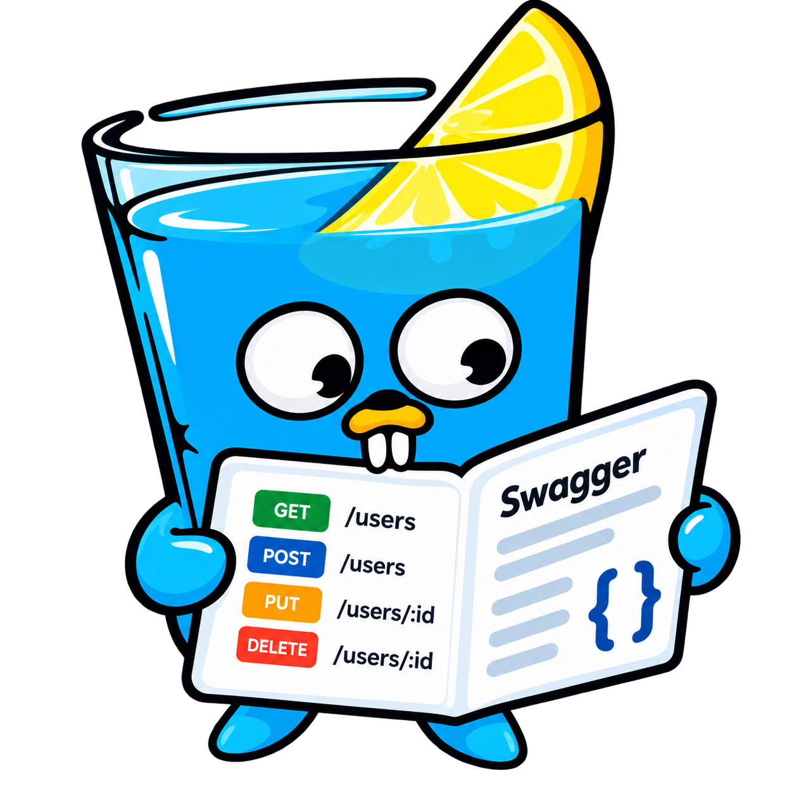

<div align="center">



# gindocs

### *Automatic, annotation-free API docs for Gin*

**Register routes. Add one line. Get docs.**

<br>

[](https://go.dev)
[](https://github.com/anikchand461/gindocs/tags)
[](LICENSE)
<br>
[](https://pkg.go.dev/github.com/anikchand461/gindocs)
[](https://github.com/gin-gonic/gin)
[](https://spec.openapis.org/oas/v3.0.3)

<br>

[Problem](#-the-problem) · [Install](#-install) · [Quickstart](#-quickstart) · [Docs UI](#-the-docs-ui) · [Adding detail](#-adding-detail) · [Limitations](#-known-limitations) · [Roadmap](#-roadmap)

</div>

<br>

---

## ◈ The Problem

FastAPI gives Python developers interactive docs for free:

```text
@app.get("/users/{id}")   ──▶   /docs   ✓
```

Go developers using Gin get a **comment-driven workflow** instead. With tools like `swaggo/swag`, every handler needs a block of annotations:

```go
// GetUser godoc
// @Summary      Get a user
// @Description  Get a user by ID
// @Tags         users
// @Produce      json
// @Param        id   path      string  true  "User ID"
// @Success      200  {object}  User
// @Router       /users/{id} [get]
func GetUser(c *gin.Context) { ... }
```

…and then the same chores, forever:

```text
✗  Annotations on every single handler
✗  Run `swag init` after every change
✗  Commit a generated docs package
✗  Comments silently drift away from the real routes
✗  A new route has no docs until someone writes its comments
```

<br>

## ◈ The Solution

Gin **already knows** every route you register. gindocs reads them from `router.Routes()` and turns them into an OpenAPI document and an interactive docs page, live, at runtime.

```go
r.GET("/users", GetUsers)
r.GET("/users/:id", GetUser)

gindocs.New(r).Serve("/docs")
```

```text
Gin engine ──▶ router.Routes() ──▶ OpenAPI 3.0.3 ──▶ /openapi.json
                                                  └─▶ /docs  (interactive UI)
```

```text
✓  Zero annotations, zero code generation
✓  Routes are read live, so docs never drift
✓  Optional, typed detail with the structs you already bind
✓  A built-in docs UI with Try it, Authorize, forms and file uploads
✓  Works offline: the UI is embedded with go:embed, no CDN
```

<br>

## ◈ Install

```bash
go get github.com/anikchand461/gindocs
```

Requires Go 1.25+ and [Gin](https://github.com/gin-gonic/gin).

<br>

## ◈ Quickstart

```go
package main

import (
	"net/http"

	"github.com/anikchand461/gindocs"
	"github.com/gin-gonic/gin"
)

func main() {
	r := gin.Default()

	r.GET("/users", func(c *gin.Context) {
		c.JSON(http.StatusOK, gin.H{"message": "users"})
	})
	r.GET("/users/:id", func(c *gin.Context) {
		c.JSON(http.StatusOK, gin.H{"id": c.Param("id")})
	})

	gindocs.New(r).Serve("/docs")

	r.Run(":8080")
}
```

| URL             | Serves                                  |
| --------------- | --------------------------------------- |
| `/docs`         | The interactive docs UI                 |
| `/openapi.json` | The generated OpenAPI 3.0.3 document    |

The spec at `/openapi.json` is standard OpenAPI 3.0.3, so you can also load it into Swagger UI, Postman, Insomnia or a client generator.

<br>

## ◈ The Docs UI

A small, dependency-free HTML/CSS/JS page (about 50 KB) embedded in the module. It loads nothing from a CDN.

| | |
|---|---|
| **Sidebar** | Routes grouped by tag, each with its summary, plus a **Schemas** section. Press `/` to filter. |
| **Endpoints** | Method, path, summary, description, tags, operationId, deprecation, and whether auth is required. |
| **Parameters** | Type, location, required flag and constraints (enum, min/max, length, default, example). |
| **Bodies & responses** | Example and Schema tabs; schemas render as an expandable tree with linked types. Form bodies are listed field by field. |
| **Schema pages** | One page per model, showing which endpoints use it. |
| **Authorize** | Bearer, Basic and API-key auth. Credentials are sent with requests and kept until the tab closes. |
| **Try it** | Typed inputs, a JSON body pre-filled from the example with code-editor behavior (auto-closing brackets and quotes, smart indentation), file pickers for uploads, JSON validation, and ⌘/Ctrl + Enter to send. |
| **Results** | Request URL, status, timing, pretty-printed body (with Download), response headers, and a live cURL command. |
| **Themes** | Light and dark. Follows your system setting by default; the header toggle overrides it and is remembered. |
| **Mobile** | On phones, routes move into a slide-out ☰ drawer and the header stays pinned. |

<br>

## ◈ What's Generated Automatically

With **no configuration**, every route gets:

| From                     | You get                                                                  |
| ------------------------ | ------------------------------------------------------------------------ |
| The path                 | `/users/:id` → `/users/{id}` with a required string `id` parameter      |
| The handler name         | Summary `GetUserByID` → "Get User By ID", and operationId `getUserByID`  |
| The first path segment   | Tag `/api/v1/users/:id` → `users` (skips `api` and `v1`-style segments)  |

Anonymous handlers (`func(c *gin.Context) {...}`) have no name, so they get no summary, and their operationId comes from the method and path (`getUsersId`).

* **Methods:** `GET`, `POST`, `PUT`, `PATCH`, `DELETE`, `HEAD`, `OPTIONS`, `TRACE`. Methods OpenAPI can't express, such as `CONNECT`, are skipped.
* **Responses:** routes without declared responses get one `default` response, because OpenAPI requires at least one.
* **Live:** routes are read each time the spec is requested, so routes registered after `Serve` show up too. The docs' own routes are left out.

<br>

## ◈ Adding Detail

Request and response types aren't visible from a Gin handler, so you can declare them for the routes that matter, using **the same structs your handlers already bind**:

```go
docs := gindocs.New(r)
docs.Title = "Users API"
docs.Description = "Authorize with the token `demo-token`."
docs.BearerAuth() // or BasicAuth(), APIKey("X-API-Key")

docs.Route("GET /health").Public()
docs.Route("GET /api/v1/users").
	Query(ListUsersQuery{}).   // struct with `form` tags, as for c.ShouldBindQuery
	Response(200, UserList{})
docs.Route("POST /api/v1/users").
	Summary("Create a user").
	Body(CreateUserRequest{}). // as for c.ShouldBindJSON
	Response(201, User{}).
	Response(400, APIError{})
docs.Route("DELETE /api/v1/users/:id").
	Path(UserURI{}).           // struct with `uri` tags, as for c.ShouldBindUri
	Response(204, nil)

docs.Serve("/docs")
```

| `Route` method                        | Effect                                                                  |
| ------------------------------------- | ----------------------------------------------------------------------- |
| `Summary`, `Description`              | Override the summary from the handler name; add Markdown-lite text       |
| `Tags(...)`                           | Override the tag from the path                                          |
| `Body(v)`                             | JSON request body schema from `v`'s type                                |
| `Form(v)`                             | Form body from a struct with `form` tags; file fields make it multipart  |
| `Query(v)`, `Path(v)`                 | Query parameters / typed path parameters from a struct                  |
| `Response(status, v)`                 | A response with its JSON schema (`nil` for no body)                     |
| `Deprecated()`, `Public()`, `Hide()`  | Mark deprecated, exempt from auth, or leave out of the docs             |

Patterns accept Gin (`:id`) or OpenAPI (`{id}`) syntax. `Route` panics on a malformed pattern, a non-struct `Query`/`Path`/`Form`, or a route given both `Body` and `Form`, so mistakes show up at startup.

### Forms and file uploads

Use `Form` with the struct you pass to `c.ShouldBind`. File fields use Gin's `*multipart.FileHeader`:

```go
type AvatarForm struct {
	Avatar  *multipart.FileHeader   `form:"avatar" binding:"required"`
	Extras  []*multipart.FileHeader `form:"extras"` // several files
	Caption string                  `form:"caption" binding:"max=80"`
}

type LoginForm struct {
	Username string `form:"username" binding:"required"`
	Password string `form:"password" binding:"required"`
}

docs.Route("POST /api/v1/users/:id/avatar").Form(AvatarForm{}) // multipart/form-data
docs.Route("POST /login").Form(LoginForm{})                     // application/x-www-form-urlencoded
```

A form with at least one file field is documented as `multipart/form-data`; without file fields it's `application/x-www-form-urlencoded`. In Try it, the first gets file pickers and the second plain inputs, and the cURL preview uses `-F` / `--form-string` or `--data-urlencode` to match.

### How structs become schemas

Named structs become reusable schemas under `components/schemas`, referenced by name, so recursive types work. Field rules follow `encoding/json` (`json` tags, `-`, embedded structs flattened), and these tags are read:

| Tag                                       | Becomes                                                                       |
| ----------------------------------------- | ----------------------------------------------------------------------------- |
| `binding:"required"` (or `validate`)      | Required field                                                                |
| `binding:"oneof=a b"`                     | `enum`                                                                        |
| `binding:"min=1,max=10"` / `gte`, `lte`   | `minimum`/`maximum`, `minLength`/`maxLength` or `minItems`/`maxItems` by type |
| `binding:"email"`, `url`, `uuid`          | `format`                                                                      |
| `description:"..."`                       | Field description                                                             |
| `example:"..."`                           | Example value, parsed to the field's JSON type                                |

`time.Time` becomes a `date-time` string, `*multipart.FileHeader` a file (`string`/`binary`), `[]byte` a base64 string, maps become `additionalProperties`, and interfaces accept any value.

### Other options

```go
docs.Version = "2.1.0"           // default "1.0.0"
docs.SpecPath = "/api/spec.json" // default "/openapi.json"
```

`docs.JSON()` returns the spec as JSON, which is handy for writing it to a file in CI.

<br>

## ◈ Known Limitations

* **Types must be declared.** Request and response schemas come from `Route(...)`. Gin handlers don't expose them, so they aren't inferred yet. A `Route` pattern that matches no registered route is silently ignored.
* **One body type per route.** A route documents either a JSON `Body` or a `Form`, not both, even if the handler accepts either through `c.ShouldBind`.
* **Auth applies globally.** `BearerAuth`/`BasicAuth`/`APIKey` cover every route except `Public()` ones. There's no per-route choice between schemes and no OAuth2 flows.
* **Catch-all wildcards.** OpenAPI path parameters can't contain `/`, so `/files/*filepath` becomes a single `{filepath}` parameter. The built-in UI sends slashes as typed; other OpenAPI tools may encode them as `%2F`, which Gin still decodes as long as `UseRawPath` is off (the default).
* **Absolute URLs.** The docs page loads its assets and spec from absolute paths, so serving it behind a reverse proxy that strips a path prefix won't work yet.

<br>

## ◈ Roadmap

- [x] Routes, path parameters, summaries, tags and operationIds with zero config
- [x] Typed bodies, query/path structs and responses via `Route(...)`
- [x] Bearer, Basic and API-key auth with an Authorize dialog
- [x] Forms and file uploads
- [x] Custom docs UI: Try it, schema pages, light/dark themes, mobile drawer
- [ ] Detect request and response types from handler code automatically
- [ ] OAuth2 password flow in the Authorize dialog
- [ ] `oneOf` / `anyOf` / `allOf` schemas and named examples
- [ ] Per-route auth schemes
- [ ] Relative URLs for docs served behind a path-prefixing proxy

<br>

## ◈ Development

```bash
go test ./...
go run ./examples/full    # types, forms, uploads, bearer auth → http://localhost:8081/docs (token: demo-token)
```

```text
gindocs.go           Public API: New, Docs, Serve, JSON, BearerAuth, BasicAuth, APIKey
route.go             Optional per-route documentation (Docs.Route)
internal/openapi/    OpenAPI types, path conversion, naming, struct → schema reflection, generation
internal/ui/         Embedded docs page (index.html, app.css, app.js)
examples/full/       Typed bodies, forms and file uploads, query/path structs, responses and auth
frontend/            Project website (static HTML/CSS/JS)
```

`internal/ui/app.js` and `app.css` are plain files with no build step. Edit them, restart the example, and reload `/docs`.

<br>

## ◈ License

MIT. See [LICENSE](LICENSE).

<div align="center">
<br>

<br>
<sub>Built for Gophers who'd rather write handlers than comments.</sub>
</div>
